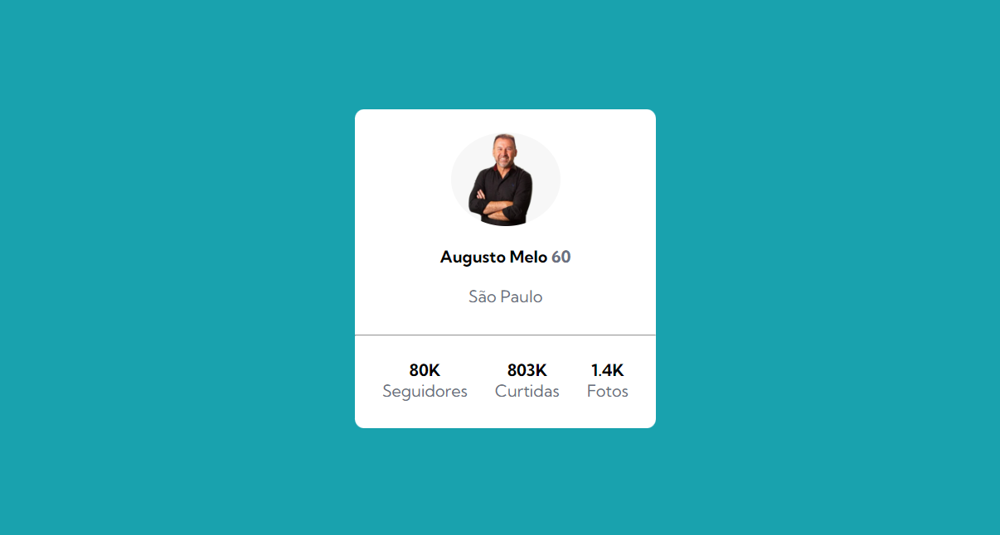

# Desafio cartão de Perfil

Esse é um desafio do frontend mentor. Onde o principal desafio é criar um cartão que contenha as informações de perfil. Para ser aprimorado as habilidades de posicionamento de elementos usando flexbox. Pra dar uma diferenciada, de tão corinthiano que eu sou, acabei homenageando e fazendo esse perfil com o atual presidente do Corinthians, Augusto Melo.

### Layuot Deskitop 

### Layout Mobile

